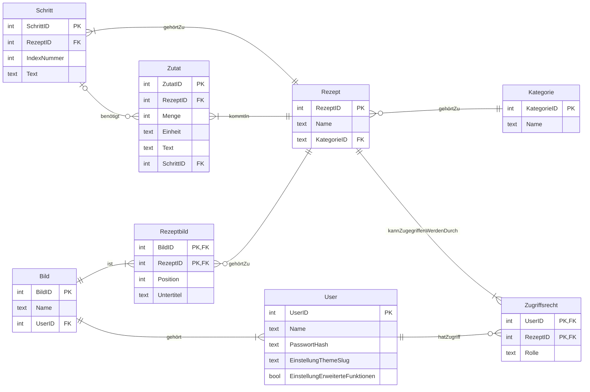

# ER-Diagramm

```mermaid
erDiagram
direction LR

Rezept {
    int RezeptID PK
    text Name
    text KategorieID FK
}

Kategorie {
    int KategorieID PK
    text Name
}

Bild {
    int BildID PK
    text Name
    int UserID FK
}

Rezeptbild {
    int BildID PK, FK
    int RezeptID PK, FK
    int Position
    text Untertitel
}

Zutat {
    int ZutatID PK
    int RezeptID FK
    int Menge
    text Einheit
    text Text
    int SchrittID FK
}

Schritt {
    int SchrittID PK
    int RezeptID FK
    int IndexNummer
    text Text
}

User {
    int UserID PK
    text Name
    text PasswortHash
    text EinstellungThemeSlug
    bool EinstellungErweiterteFunktionen
}

Zugriffsrecht {
    int UserID PK, FK
    int RezeptID PK, FK
    text Rolle
}

Rezept }o--|| Kategorie: gehörtZu
Bild ||--|{ Rezeptbild: ist
Rezeptbild }o--|| Rezept: gehörtZu
Bild ||--|{ User: gehört
Zutat }|--|| Rezept: kommtIn
Schritt }|--|| Rezept: gehörtZu
Schritt |o--o{ Zutat: benötigt
User ||--o{ Zugriffsrecht: hatZugriff
Rezept ||--|{ Zugriffsrecht: kannZugegriffenWerdenDurch
```