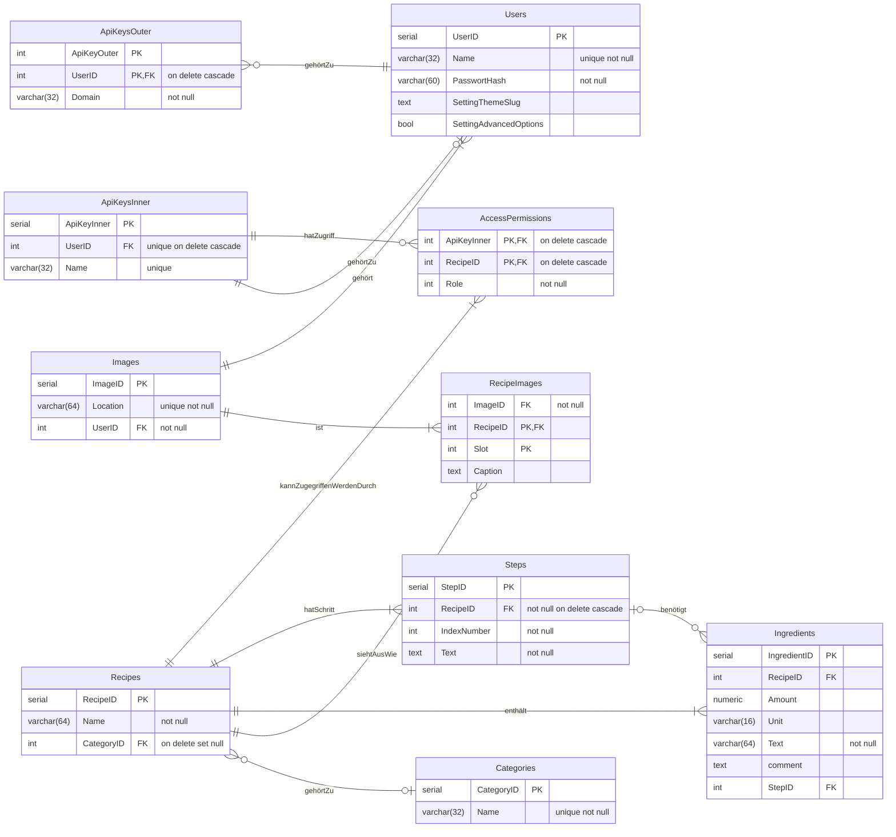

# ER-Diagramm

```mermaid
erDiagram
direction LR

Users {
    serial UserID PK
    varchar(32) Name "unique not null"
    varchar(60) PasswortHash "not null"
    text SettingThemeSlug
    bool SettingAdvancedOptions
}

Categories {
    serial CategoryID PK
    varchar(32) Name "unique not null"
}

Recipes {
    serial RecipeID PK
    varchar(64) Name "not null"
    int CategoryID FK "on delete set null"
}

Steps {
    serial StepID PK
    int RecipeID FK "not null on delete cascade"
    int IndexNumber "not null"
    text Text "not null"
}

Ingredients {
    serial IngredientID PK
    int RecipeID FK
    numeric Amount
    varchar(16) Unit
    varchar(64) Text "not null"
    text comment
    int StepID FK
}

ApiKeysInner {
    serial ApiKeyInner PK
    int UserID FK "unique on delete cascade"
    varchar(32) Name "unique"
}

ApiKeysOuter {
    int ApiKeyOuter PK
    int UserID PK, FK "on delete cascade"
    varchar(32) Domain "not null"
}

AccessPermissions {
    int ApiKeyInner PK, FK "on delete cascade"
    int RecipeID PK, FK "on delete cascade"
    int Role "not null"
}

Images {
    serial ImageID PK
    varchar(64) Location "unique not null"
    int UserID FK "not null"
}

RecipeImages {
    int ImageID FK "not null"
    int RecipeID PK, FK
    int Slot PK
    text Caption
}

Recipes }o--o| Categories: gehörtZu
Images ||--|{ RecipeImages: ist
Recipes ||--o{ RecipeImages: siehtAusWie
Images ||--|{ Users: gehört
Recipes ||--|{ Ingredients: enthält
Recipes ||--|{ Steps: hatSchritt
Steps |o--o{ Ingredients: benötigt
ApiKeysInner ||--o| Users: gehörtZu
ApiKeysOuter }o--|| Users: gehörtZu
ApiKeysInner ||--o{ AccessPermissions: hatZugriff
Recipes ||--|{ AccessPermissions: kannZugegriffenWerdenDurch
```