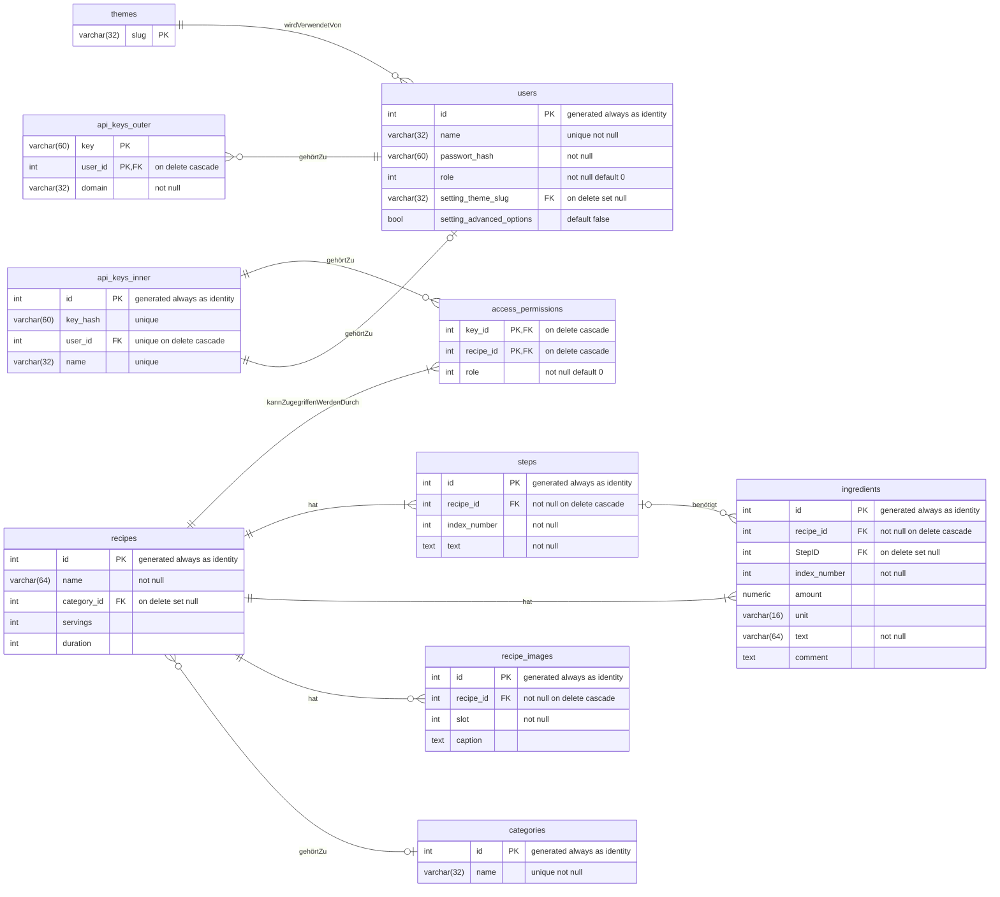

# ER-Diagramm

```mermaid
erDiagram
direction LR

u[users] {
    int id PK "generated always as identity"
    varchar(32) name "unique not null"
    varchar(60) passwort_hash "not null"
    int role "not null default 0"
    varchar(32) setting_theme_slug FK "on delete set null"
    bool setting_advanced_options "default false"
}

c[categories] {
    int id PK "generated always as identity"
    varchar(32) name "unique not null"
}

r[recipes] {
    int id PK "generated always as identity"
    varchar(64) name "not null"
    int category_id FK "on delete set null"
    int servings
    int duration
}

s[steps] {
    int id PK "generated always as identity"
    int recipe_id FK "not null on delete cascade"
    int index_number "not null"
    text text "not null"
}

i[ingredients] {
    int id PK "generated always as identity"
    int recipe_id FK "not null on delete cascade"
    int StepID FK "on delete set null"
    int index_number "not null"
    numeric amount
    varchar(16) unit
    varchar(64) text "not null"
    text comment
}

apii[api_keys_inner] {
    int id PK "generated always as identity"
    varchar(60) key_hash "unique"
    int user_id FK "unique on delete cascade"
    varchar(32) name "unique"
}

apio[api_keys_outer] {
    varchar(60) key PK
    int user_id PK, FK "on delete cascade"
    varchar(32) domain "not null"
}

a[access_permissions] {
    int key_id PK, FK "on delete cascade"
    int recipe_id PK, FK "on delete cascade"
    int role "not null default 0"
}

im[recipe_images] {
    int id PK "generated always as identity"
    int recipe_id FK "not null on delete cascade"
    int slot "not null"
    text caption
}

t[themes] {
    varchar(32) slug PK
}

r }o--o| c: gehörtZu
r ||--o{ im: hat
r ||--|{ i: hat
r ||--|{ s: hat
s |o--o{ i: benötigt
apii ||--o| u: gehörtZu
apio }o--|| u: gehörtZu
apii ||--o{ a: gehörtZu
t ||--o{ u: wirdVerwendetVon
r ||--|{ a: kannZugegriffenWerdenDurch
```